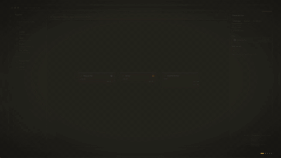

# runsight

**YAML-first workflow engine for AI agents.** Your workflows are files. Your repo is the database. Git is your version control.

[](LICENSE)
[](https://pypi.org/project/runsight/)
[](https://www.python.org)
[](https://runsight.ai/docs)
[](https://github.com/runsight-ai/runsight)
[](https://www.cubic.dev/)

<p align="center">
  
</p>

Runsight runs AI agent workflows defined in plain YAML files on your filesystem. Every workflow, soul (agent identity), and tool definition is a diffable file in your repo. Save writes to disk. Commit pushes to git. Runs track which commit produced them. No database for workflow definitions — just files and git.

32 shipped epics, 215+ tickets, 6 block types, built-in eval, and per-run budget enforcement.

## Quick start

```bash
uvx runsight
```

Open [http://localhost:8000](http://localhost:8000). Your YAML files in `custom/` are your workflows.

Runsight starts a blank workspace with empty `custom/workflows/`, `custom/souls/`, and
`custom/tools/` directories plus `.runsight/` for runtime state. No sample workflows,
souls, or tools are pre-shipped. Sample content is not shipped into the runtime path, so
the onboarding flow helps you create your first workflow.

> Don't have `uv`? Install it first: `curl -LsSf https://astral.sh/uv/install.sh | sh`

Or use Docker:

```bash
docker run -p 8000:8000 -v $(pwd):/workspace ghcr.io/runsight-ai/runsight
```

Mount the whole workspace root, not only `custom/`, if you want `.runsight/` DB and
settings persistence across container restarts. Runsight keeps runtime-owned files under
that workspace root in `.runsight/`.

**[Documentation](https://runsight.ai/docs)** · [GitHub Discussions](https://github.com/runsight-ai/runsight/discussions) · [Issues](https://github.com/runsight-ai/runsight/issues)

## What it does

| Feature | What you get |
|---|---|
| **YAML workflows** | Workflows are `.yaml` files on disk. Edit in any editor, diff in any tool, review in any PR. |
| **Git-native execution** | Save = write to disk. Commit = git commit to main. Dirty runs create simulation branches automatically. |
| **6 block types** | `linear` (LLM call), `gate` (LLM quality gate), `code` (Python), `loop` (iteration), `workflow` (sub-flow composition), `dispatch` (parallel branching) |
| **Dispatch branching** | The soul calls a `delegate` tool to pick an exit port — LLM-driven routing on any block with `exits` |
| **Soul library** | Agent identities as reusable YAML files or inline in the workflow. Role, system_prompt, provider, model, temperature, tools. Referenced by `soul_ref`. |
| **Custom tools** | Define tools as YAML files in `custom/tools/`. Canonical IDs are filename stems (e.g., `slack_payload_builder`). Discovered automatically. Workflows declare which tools are available — souls only get tools enabled at the workflow level. |
| **Visual canvas** | ReactFlow-based editor with bi-directional YAML sync. `[alpha]` |
| **Monaco YAML editor** | Syntax highlighting, live YAML validation — side by side with the canvas. |
| **Block-level eval** | Assertions on any block: `contains`, `regex`, `contains-json`, `word-count`. Transform hooks extract fields before asserting. |
| **Offline eval runner** | Define test cases in an `eval:` YAML section. Run them offline with fixture mode — no LLM calls needed. |
| **Budget enforcement** | `limits:` section on workflows and blocks. Cost caps (USD), timeouts (seconds), warn or kill modes. Enforced per LLM call. |
| **Run inspection** | Full run history with regressions. Fork recovery from failed runs. Historical YAML snapshot per run. |
| **Provider management** | CRUD for providers, model catalog, per-provider fallback targets, strict soul resolution. |
| **Sub-workflow composition** | `workflow` blocks execute child workflows with parent-child run linkage, on_error modes, and output mapping. |

## YAML example

For more complete workflow examples, see the [Quickstart workflow examples](https://runsight.ai/docs/getting-started/quickstart/#create-a-workflow-file).

```yaml
version: "1.0"
souls:
  writer:
    id: writer
    kind: soul
    name: Writer
    role: Technical Writer
    system_prompt: >
      Summarize the input into a short release note.
    provider: openai
    model_name: gpt-4.1-mini
blocks:
  summarize:
    type: linear
    soul_ref: writer
workflow:
  name: Summarize
  entry: summarize
```

## Development and contributing

Contributors are welcome. Questions and ideas go to [Discussions](https://github.com/runsight-ai/runsight/discussions), and open work lives on [Issues](https://github.com/runsight-ai/runsight/issues).

Local setup:

```bash
git clone https://github.com/runsight-ai/runsight.git
cd runsight

# Install dependencies
uv sync              # Python 3.11+
pnpm install         # Node 20+ (installs all workspace packages)

# Start API server + GUI (two terminals)
uv run runsight                        # http://localhost:8000
pnpm -C apps/gui dev                   # http://localhost:5173
```

Targeted checks:

```bash
# Run frontend unit tests
pnpm -C apps/gui test:unit

# Run engine tests (target specific files — full suite is heavy)
uv run python -m pytest packages/core/tests/test_specific_file.py -v

# Lint
pnpm run lint
```

Release process:

1. Bump `version` in the root `pyproject.toml`
2. Merge to `main`
3. CI publishes PyPI and Docker artifacts, then creates the git tag automatically

No manual tagging needed. Every PR that changes behavior should include a version bump.

## License

Apache 2.0 — see [LICENSE](LICENSE).
